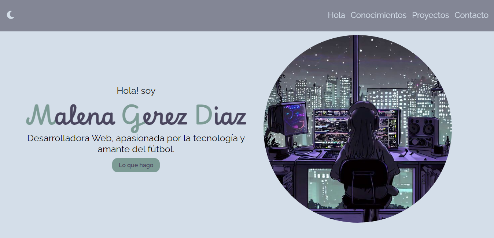
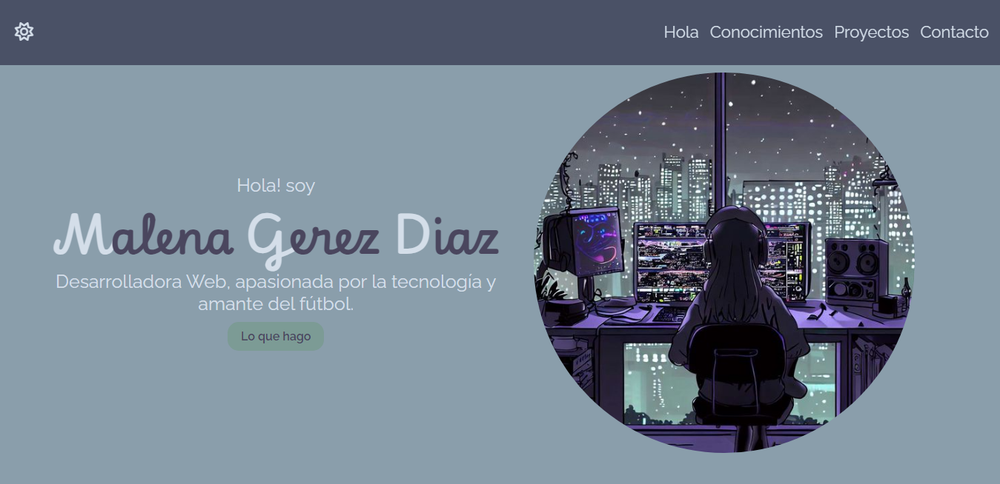
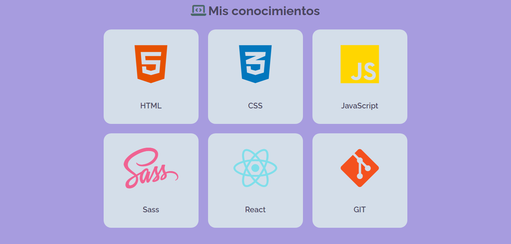
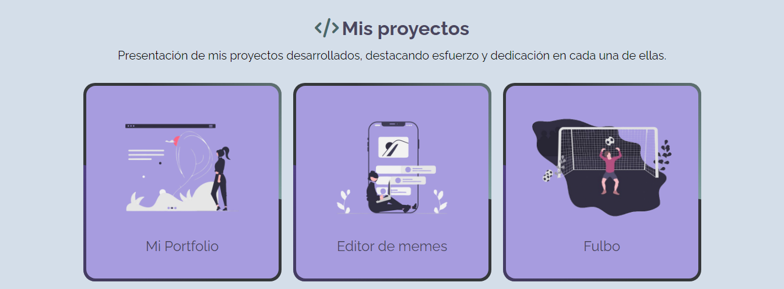
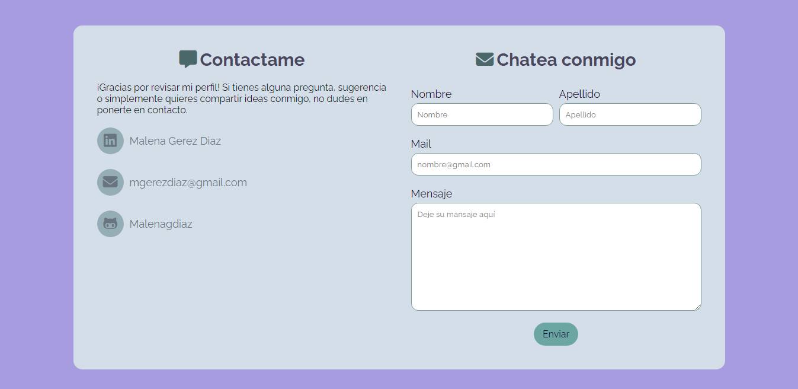
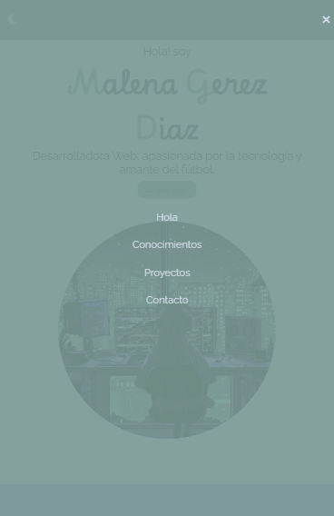

# ⋅˚₊‧ ୨Mi portfolio୧ ‧₊˚ ⋅

Les presento el rediseño de mi **portfolio** personal. Este proyecto es el resultado de una completa actualización para mejorar la estética y darle mejor funcionalidad. Aquí podrás explorar mis conocimientos y mis proyectos, todo presentado de manera más atractiva.

## Estructura del sitio web 🌐

### Inicio ✨

El **inicio de mi página** incluye un encabezado que presenta un menú de navegación eficiente, diseñado para facilitar el desplazamiento rápido entre las principales secciones del sitio. Además, está equipado con controles de tema que permiten al usuario alternar entre el modo claro y el modo oscuro, adaptando la interfaz a sus preferencias visuales.

Aquí presento un ejemplo visual de cómo se vería el sitio al cambiar al modo oscuro:

### Conocimientos 🧐

### Mis Conocimientos

En la sección de **Conocimientos**, muestro las habilidades y tecnologías que he adquirido. Incluye áreas clave como HTML, CSS, JavaScript, SASS, REACT y GIT, presentadas con íconos representativos para una comprensión visual más clara.

### Proyectos </>₊⊹

En la sección de **Proyectos**, presento una serie de trabajos destacados. Aunque la imagen muestra solo tres de ellos, en total hay seis proyectos que puedes explorar. Te invito a visitar esta sección para ver todos mis proyectos y explorar en detalle cada uno de ellos.

### Contacto 💌

La sección de **Contacto** ofrece múltiples formas para que los visitantes se pongan en contacto conmigo. Incluye un formulario de contacto y enlaces a mis perfiles en redes sociales, facilitando la comunicación.

### Footer ⋆˚✿

El **Footer** proporciona enlaces de navegación adicionales y enlaces a mis redes sociales. Es una sección accesible que permite a los usuarios volver a las secciones principales y conectarse conmigo a través de plataformas sociales.

### Diseño Responsive •ᴗ•

En el diseño responsive, he integrado un menú hamburguesa que se activa exclusivamente en dispositivos móviles. Este menú permite una navegación eficiente y accesible en pantallas más pequeñas, facilitando el acceso a las principales secciones del sitio con solo un toque.

### Tecnologías Utilizadas 💻

Para el desarrollo de este proyecto, se emplearon las siguientes tecnologías clave:

- **HTML** 🌐 — Estructuración del contenido web
- **CSS** 🎨 — Estilización y diseño visual
- **JavaScript** ✨ — Interactividad y funcionalidad dinámica

### Créditos 🏅

Desarrollado con dedicación y pasión por Malena. Hecho con mucho 🤍.
