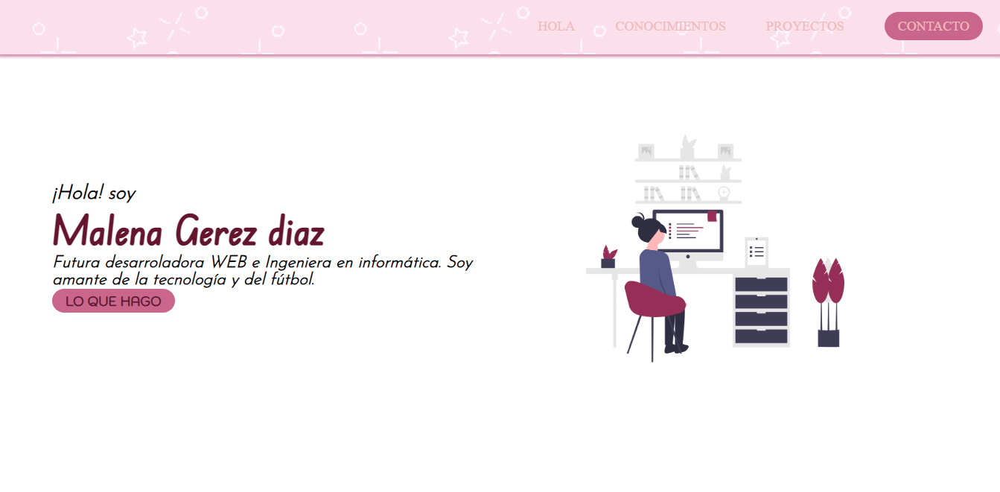
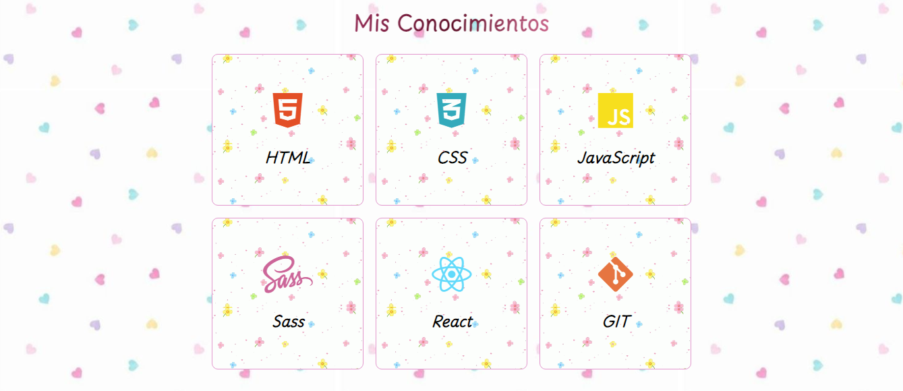
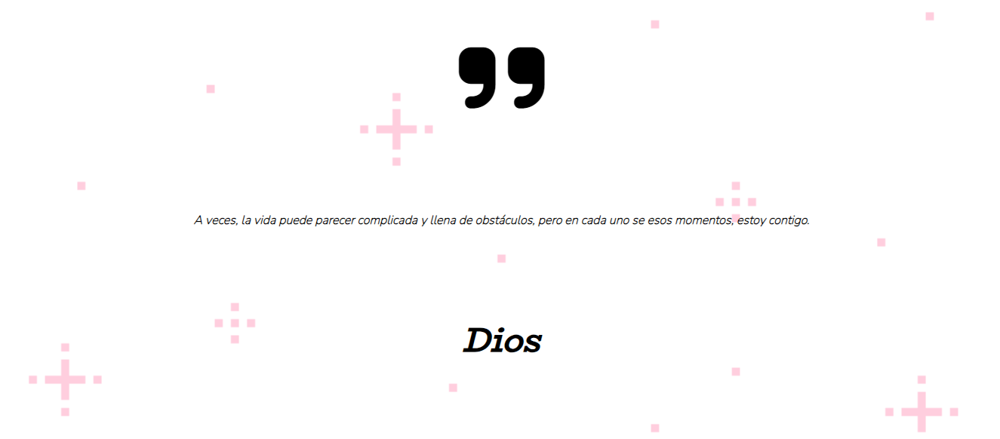
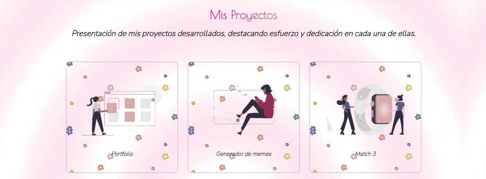
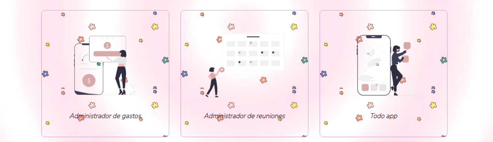
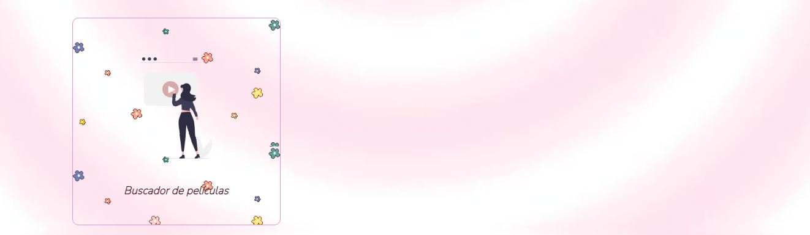
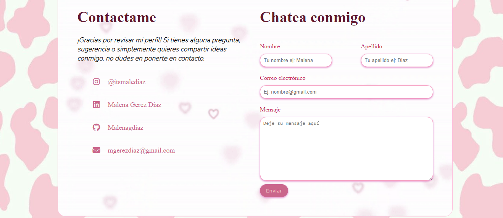
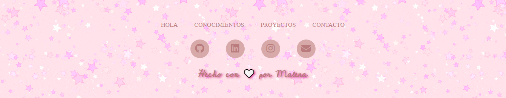

# Proyecto-Portfolio
¡Bienvenidos a mi primer proyecto desarrollado en ADA! Estoy emocionada de poder prensetar mi primer portfolio. Este proyecto respresenta el aprendizaje, y sobre todo, desafíos superados. ¡Te invito a explorar mi trabajo!

## Mi proyecto cuenta con
Este es el Inicio de mi página, donde tiene un navbar que te permite desplazarte con tan solo tocar los link de navegacion. ¡Puedes navegar sin mucho esfuerzo!. Y por debajo hay una pequeña presentación mía que cuenta tambien con un botón que te llevará a una sección, en este caso, mis proyectos.

Como mencioné antes, al clickear uno de los links del navbar, como por ejemplo, mis conocimientos. Podrás observar los conocimientos que obtuve a medida que avanzaba en mi estudio en ADA.

En el proyecto nos pidieron que pongamos una frase que nos guste. Yo elegí este porque me identifico muchísimo, ya que al atravesar muchos obstáculos, Dios siempre estuvo conmigo, sosteniéndome. 

Esta es la presentación de mis proyectos que fueron desarrollados con mucho pero mucho esfuerzo. El realizar cada detalle, desde adentro y afuera, ¡Fue un gran desafío!

En esta sección podrás ver la parte de contacto, donde pueden escribirme para contactarse conmigo, es una sección que me gusta bastante por los detalles. 

Por último, este es el footer, aquí tambien podrás clikear y que te lleve a la sección correspondiente, tambien cuenta con mis redes sociales para que también puedan contactarse conmigo.

## En Resumen
Fue una gran experiencia realizar este proyecto. Le dediqué mucho empeño y entusiasmo a cada detalle . Cada sección tiene su diseño único, con la incorporación de imágenes y gifs, algo que nunca me hubiera imaginado poder hacer. Me encantó llevar a cabo mi primer proyecto y descubrir todo lo que puedo lograr en este fascinante mundo del desarrollo web.🤍